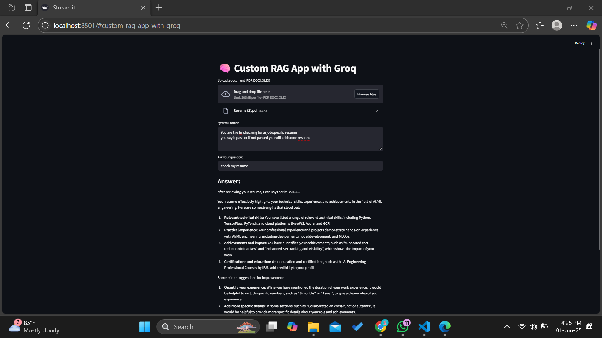

# 🧠 SmartAgent2 (Full Updated)

This repo contains a fully updated Retrieval-Augmented Generation (RAG) system built with Streamlit and Groq, using LangChain 0.0.281+ and the community modules.

## Folder Structure

```
rag_app_full_updated/
├── app.py
├── utils/
│   └── loaders.py
├── requirements.txt
├── Dockerfile
├── .env
└── README.md
```

## Setup Instructions

1. **Clone or Download** this repository.

2. **Install Dependencies**  
   ```bash
   pip install -r requirements.txt
   ```

3. **Set Your Groq API Key**  
   Create a `.env` file (already included) and add:
   ```
   GROQ_API_KEY=your-groq-api-key
   ```
   Replace `your-groq-api-key` with your actual key from https://console.groq.com.(Free)

4. **Run the Streamlit App**  
   ```bash
   streamlit run app.py
   ```
   By default, Streamlit listens on port 8501.

5. **Upload a Document**  
   - Supports PDF, DOCX, and XLSX files.  
   - Enter a custom system prompt (e.g., "You are a strict ISO auditor").  
   - Type your question and press Enter.  

6. **Deployment (Optional)**  
   - Build Docker image:
     ```bash
     docker build -t rag_app_full_updated .
     ```
   - Run in container:
     ```bash
     docker run -d -p 8501:8501 --env-file .env rag_app_full_updated
     ```

## Key Features

🛠️ Technical Stack

Frontend: Streamlit
LLM Framework: LangChain
Vector Database: FAISS
Embeddings: HuggingFace Transformers
Language Model: Groq (Llama 3.3 70B)
Document Processing: PyPDF2, python-docx, openpyxl
